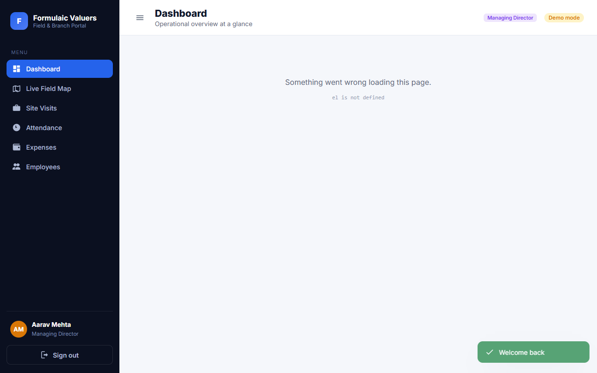
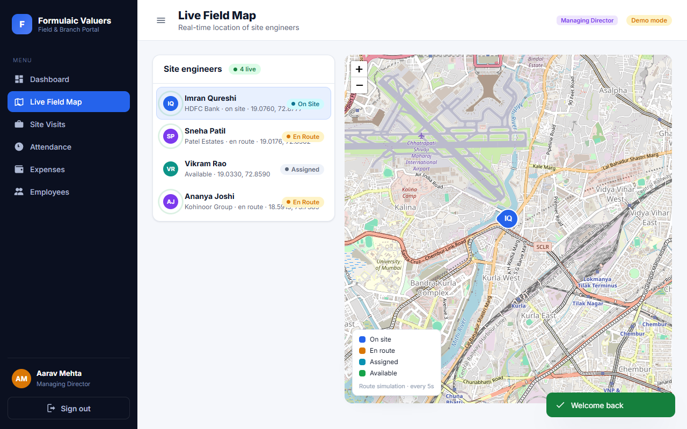

# Formulaic Portal

A field-and-branch operations portal for **valuation companies**. It gives every
role — Site Engineers, Drafters, Operators, Technical Managers, Branch Heads and
the Managing Director — a single place to run day-to-day operations.

Built with plain **HTML, CSS and JavaScript** (no build step) and backed by
**Supabase** (PostgreSQL + Auth + Realtime). It ships with a fully working
**demo mode** so you can explore every screen instantly without a backend.

---

## Features

- **Live field map** — track Site Engineers in real time on an interactive map,
  the way Swiggy/Zomato track delivery partners. Markers move live, show speed,
  battery and the job each engineer is on, and draw a recent trail.
- **CSV track replay** — drop a GPS log (`t,lat,lng`) onto the field map and
  play the route back: scrub, change speed, loop, read live position/speed, and
  inspect the parsed rows in a table.
- **Attendance** — geo-stamped check-in / check-out for every employee, plus a
  manager view of who's present, late, on leave or absent.
- **Branch expenses & expenditure** — record expenses per branch, track monthly
  budgets, and approve / reject / reimburse claims. The Managing Director can
  switch between branches; everyone else is scoped to their own branch.
- **Site visits** — create valuation jobs, assign engineers, and move jobs
  through `assigned → en route → on site → completed`.
- **Employees** — searchable team directory with roles and branches.
- **Admin login for the Managing Director** — company-wide dashboards covering
  spend, pipeline value, attendance and field-staff status across all branches.
- **Role-based access** — navigation and data are scoped to each user's role.

## Screenshots

| Dashboard (Managing Director) | Live field map |
|---|---|
|  |  |

## Roles

| Role | Capabilities |
|------|--------------|
| **Managing Director** (admin) | Everything, across every branch — expenses, attendance, tracking, employees |
| **Branch Head** | Full access scoped to their branch |
| **Technical Manager** | Branch oversight, approves expenses & assigns visits |
| **Site Engineer** | Field staff — location tracked, marks own attendance, updates assigned visits |
| **Drafter** | Back-office: dashboard, map, visits, attendance |
| **Operator** | Back-office data entry: dashboard, map, visits, attendance, expenses |

---

## Quick start (demo mode)

Demo mode is on by default (`DEMO_MODE: true` in `js/config.js`) and runs
entirely in the browser against simulated data in `localStorage`.

```bash
npm install
npm start
#   …or without npm…
npx serve -l 5173 .
#   …or…
python3 -m http.server 5173
```

Then open <http://localhost:5173> and sign in with a demo account
(password **`demo1234`**), or click any account chip on the login screen:

| Role | Email |
|------|-------|
| Managing Director | `md@formulaic.in` |
| Branch Head | `head.mumbai@formulaic.in` |
| Technical Manager | `tech@formulaic.in` |
| Site Engineer | `imran@formulaic.in` |
| Drafter | `drafter@formulaic.in` |
| Operator | `operator@formulaic.in` |

Open **Live Field Map** as the MD or a Branch Head to watch engineers move.

Checks:

```bash
npm test              # replay engine unit tests (no browser needed)
npm run smoke         # headless sign-in check (requires Chrome or Edge)
npm run smoke:replay  # headless CSV replay check (requires Chrome or Edge)
```

Regenerate README screenshots:

```bash
npm run screenshots
```

---

## Login API

`POST /api/auth/login` is a Vercel/Next-style route handler at
`api/auth/login.js`. The browser calls it when that path is mounted
(`vercel dev` or a Vercel deploy); otherwise sign-in stays in the client.

```http
POST /api/auth/login
Content-Type: application/json

{ "email": "md@formulaic.in", "password": "demo1234" }
```

```json
{ "profile": { "id": "u-md", "role": "managing_director", "…" }, "session": null }
```

Unexpected failures are logged as `LOGIN ERROR:` and return HTTP 500
`{ "error": "Internal server error" }` — the cause is never sent to the client.
Wrong credentials are 401; missing fields are 400.

When `SUPABASE_URL` and `SUPABASE_ANON_KEY` are set on the function, the
handler exchanges them with Supabase Auth and returns the matching `profiles`
row plus the session tokens. Without those env vars it authenticates the same
demo accounts as the in-browser fallback.

## Going live with Supabase

1. Create a project at <https://supabase.com>.
2. In the SQL editor, run, in order:
   - `supabase/schema.sql` — tables, types, triggers, realtime publication
   - `supabase/policies.sql` — Row Level Security
   - `supabase/seed.sql` — branches + sample valuation jobs
3. Create users in **Authentication → Users** (or let them sign up). A matching
   row in `public.profiles` is created automatically by a trigger. Then set each
   user's `role` and `branch_id` using the `UPDATE` examples at the bottom of
   `seed.sql`.
4. In `js/config.js`, paste your **Project URL** and **anon public key**, and set
   `DEMO_MODE: false`.
5. Serve the files as above. The app now reads/writes Supabase and subscribes to
   realtime location updates.

## Replaying a GPS track from CSV

**Live Field Map → Track replay** plays a recorded GPS log over the map, next to
the live engineers. Pick one of the bundled samples or **Load CSV…** to open a
file from your computer.

Expected shape — elapsed seconds plus coordinates:

```csv
t,lat,lng
0.0,28.472800,77.508900
3.0,28.473100,77.509000
6.0,28.473400,77.509100
```

The parser is deliberately forgiving:

- Column names may be `t` / `time` / `timestamp`, `lat` / `latitude`, `lng` / `lon` / `longitude`
- Time may be elapsed seconds, `HH:MM:SS`, or an ISO timestamp (rebased to zero)
- Comma, semicolon, tab or pipe separated; `#` comments and blank lines ignored
- Headerless files are read as `t,lat,lng` (or `lat,lng`)
- Unreadable rows are skipped and reported instead of failing the whole file

While a track is loaded you can play/pause, scrub, run at 0.5×–16×, loop, fit
the map to the route, open the parsed rows in a **Data** table, and **download**
the CSV back to your computer. The position, speed and distance covered are
interpolated between fixes, so playback stays smooth on sparse logs.

Bundled samples live in `sample/`.

### How live tracking works in production

Site Engineers open **Live Field Map** and tap **Share my location**. The browser
streams GPS fixes (`navigator.geolocation.watchPosition`) which are inserted into
the `locations` table. A trigger keeps `live_positions` in sync, and Supabase
Realtime pushes those rows to managers' maps. (For background tracking, point a
mobile app or a lightweight device agent at the same `locations` table.)

---

## Project structure

```
index.html              App shell + CDN includes (Leaflet, Supabase)
css/styles.css          Design system
js/
  config.js             Supabase credentials + demo toggle
  app.js                Bootstrap + hash router
  data.js               Data layer (Supabase  ⇄  demo fallback)
  mock.js               In-browser demo backend + live movement simulator
  replay.js             CSV track parsing, geometry + playback clock
  roles.js              Roles, permissions, status helpers
  layout.js             Sidebar + topbar shell
  ui.js                 Reusable UI (modal, stat cards, charts)
  util.js               DOM/format helpers + icon set
  views/                dashboard · tracking · attendance · expenses ·
                        employees · visits · profile · login
supabase/
  schema.sql            Tables, enums, triggers, realtime
  policies.sql          Row Level Security
  seed.sql              Branches + demo jobs
sample/                 Example GPS logs for track replay
scripts/                Smoke tests, replay tests, screenshot capture
api/auth/login.js       POST /api/auth/login (Vercel / Next-style handler)
```

## Tech

- Vanilla JS (ES modules), HTML, CSS — no build tooling required
- [Leaflet](https://leafletjs.com/) + OpenStreetMap tiles for the map
- [Supabase](https://supabase.com/) for database, auth and realtime
- Data exchanged as JSON throughout

## License

MIT
